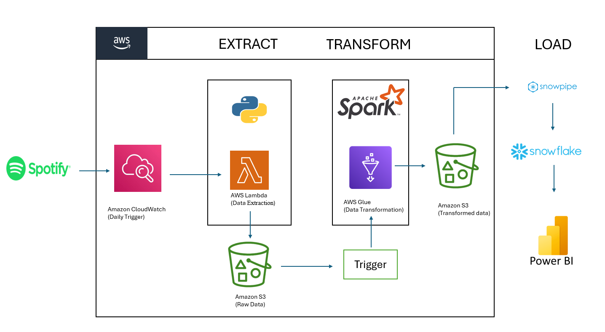
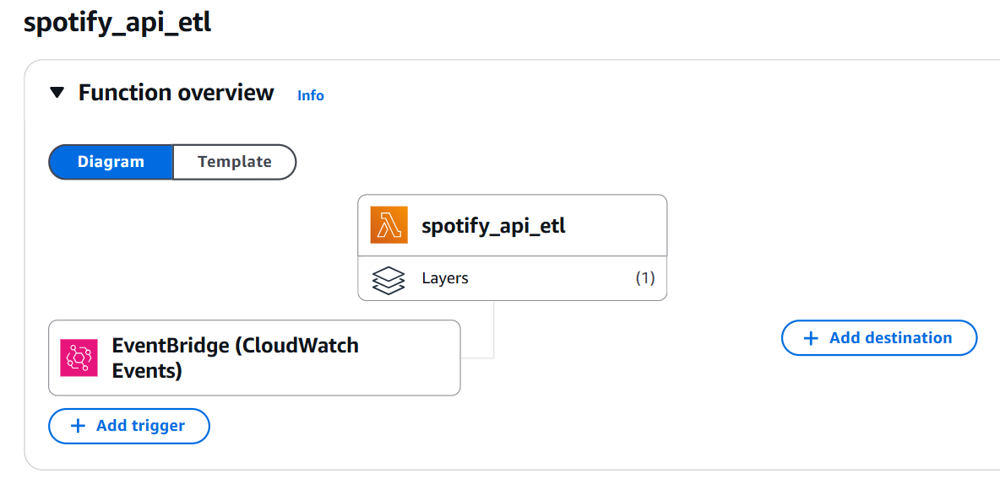
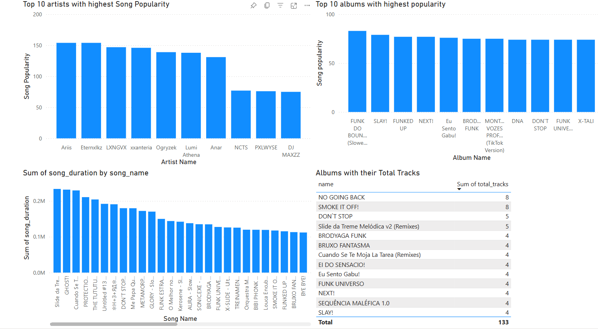

# Spotify_ETL_Pipeline

This project implements an ETL Pipeline for Spotify Data using a combination of AWS services, Snowflake, and Power BI. The goal is to extract Spotify playlist data, transform it, and load it into a Snowflake database for further analysis and visualization.

## Workflow Description

### 1. Data Extraction: AWS Lambda
A Spotify API is used to extract raw playlist data in JSON format. The connection is established using SpotifyClientCredentials, where client credentials (Client ID and Secret) are securely stored in the Lambda environment variables.

The lambda_function.py script:
1. Retrieves playlist details using the Spotify API.

2. Saves the raw JSON data into an Amazon S3 bucket (spotify-data-manvith) under the folder raw_data/to-be-processed_data/. The file is named using a timestamp for unique identification.

3. Triggers an AWS Glue Job (Spotify_transformation_job) to process the extracted data.
This function is triggered every minute using Amazon CloudWatch.

This function is triggered every minute using Amazon CloudWatch.

### 2. Data Transformation: AWS Glue

The transformation process is implemented in the spark_transformation.py script using PySpark with Glue Context.

Steps performed:
1. Raw Data Processing: The script processes the raw JSON data to extract details about albums, artists, and songs.
2. Custom Functions:
process_album: Extracts album_id, album_name, release_date, total_tracks, and album_url.
process_artists: Extracts artist_id, artist_name, and artist_url.
process_songs: Extracts song_name, song_id, duration_ms, song_url, popularity, and links with corresponding albums and artists.

3. Transformations: Basic transformations such as:
Flattening nested JSON structures using explode.
Formatting the added_at field to a standard DATE format.
4. Output: Transformed data is saved back into S3 under transformed_data/ in separate folders (album, artists, songs) as CSV files.

### 3. Data Loading: Snowflake
A Snowflake SQL script (snowflake.sql) creates a database (spotify_db) with tables for albums (tbl_album), artists (tbl_artists), and songs (tbl_songs).
Snowpipe Integration:
1. An S3 bucket (spotify-data-manvith) is integrated with Snowflake using Storage Integration (s3_init).
2. A Snowpipe is configured to ingest transformed data automatically into the Snowflake tables.

### 4. Data Visualization: Power BI
The Snowflake tables are connected to Power BI, where detailed visualizations are created.
Visualizations include:
1. Top 10 artists with the highest song popularity.
2. Top 10 albums with the highest popularity.
3. Song duration summaries.
4. Album statistics, such as the number of tracks per album.
The visualizations provide valuable insights into Spotify data trends.

### Key Features
Automation: Entire pipeline (ETL) is automated with triggers from CloudWatch and Snowpipe.
Scalability: Using AWS Lambda and Glue allows handling large volumes of Spotify data efficiently.
Real-time Data Updates: Snowpipe enables near-real-time updates of data in Snowflake.
Customizable Transformations: Transformation logic is adaptable to different data structures or additional requirements.

### Resources
AWS Lambda Function Code (lambda_function.py)
AWS Glue Transformation Code (spark_transformation.py)
Snowflake SQL Script (snowflake.sql)
Data Visualizations

